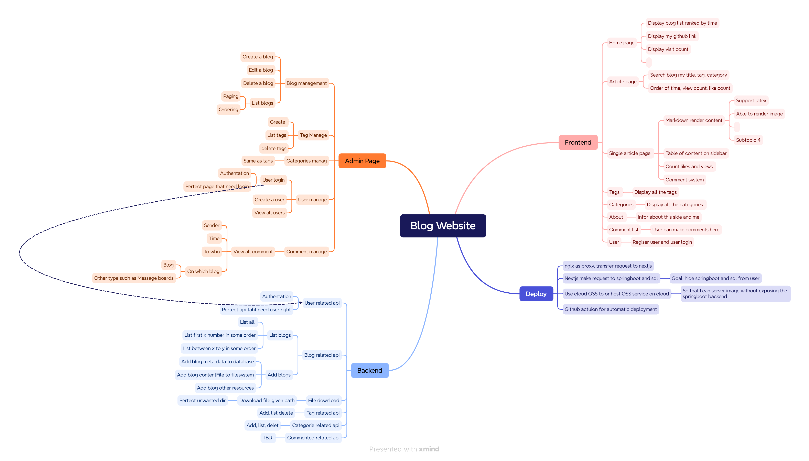

# Full stack blog website and management system with sperated backend and frontend

> This proeject is not completed, I only spend less than two weeks so far with learning nextjs, springboot, negix, docker on the fly

## Why I build this project

- I learned a lot in University, and definitly face with a lot of problem. In order to retain what I learned, and how I solve problems, I decided to note everything done, and I think it is pretty cool to shared those with others.
- I think every programmer needs a personal website
- I want to learn about web development

## Tech stack

Springboot is used for backend, and use JPA to manipulate to Mysql database.
Swagger generate Openapi documentation based on Java api definition (benefit of strong type language). And use the [openapi-cli](https://openapi-generator.tech/) to generate frontend requst code.
~~Nextjs is used for frontend and admin page.~~
Nextjs is used for frontend. Admin page is build with React with Vite

Negix is used as proxy for serving the frontend.
Docker is used for deplaying the services, where each frontend, backend, database and negix will be different contain and linked with docker-compose.

## Initial design specification

## Challenges

- Changing DTO to Entity and Entity to VO, currently the conversion logic is in service layer, but I think it is better to new constuctor for Entitys VOs and DTOs.
- Spended a lot of time to check backend api and covent data on frontend. Solve by using [Swagger](https://www.baeldung.com/spring-rest-openapi-documentation) and[openapi-cli](https://openapi-generator.tech/)
- Server render markdown. Initially I was spending a lot of time configuring [MDX](https://nextjs.org/docs/pages/building-your-application/configuring/mdx) which is recommanded by nextjs, but it don't work well for remote markdown with plugin and [react markdown](https://github.com/remarkjs/react-markdown) is all you need.
- Nextjs will fetch data from backend in build time. Since I am using `docker-compose` the springboot, so when building image for nextjs, springboot is not runining during that time. So `docker-compose build` will not build nextjs image sucessfully. I have tried `depends` configuriation on `docker-compose` file, and [dockerize](https://github.com/jwilder/dockerize), but these seems don't work. I make the nextjs working by configring every page to `"force-dynamic";` which nextjs will not cache data. And later I found out that I can build springboot first and run springboot, and build nextjs after. But I think those are not an enegient solution, so a better solution need to be found.

## What is done

### Admin page

- crate, list blogs and edit with markdown
- basic admin login (with session) and basic route pretection. Need to improve the implemtation later, probibly will use Token or JWT

### Backend

- have api to save, list, delete blogs;
- save, list, delete, change tags and categories.
- File upload and download (used to serve images and markdown content)
- Basic user login
- Add service layer to work with OSS(Object Storage Service) on cloud or host with docker [minio](https://github.com/minio/minio)

### Frontend

- display blogs brief on home page and blog page
- display all tags and categories on tag page and categories of json data (style need to be done)
- server render markdown content on single blog page support [gfm](https://github.github.com/gfm/), latex equations, code hightlighting, loading image from server.

### Deploy

- docker file and docker compose to build docker images
- negix config to proxy frontend content

## What is need to be done

### Backend

- Refactor admin pages, I was using nextjs in the wrong way
- Refactor backend Entity conversion logic
- Change user authentication logic, remove use of session (break the RESTful spec), and implementation propor way to handle protected in admin and backend
- Implement backend api for blog update
- Add various seaching and filtering api for blog on backend
- Add a column for blog introcution for display on database and backend
- User register api
- Comment related api
  - add, delete, find
- API for counting view number and like number
- API for counting site visit number or use third party service

### Frontend

- Style the tag page and categries page
- Table of content on the sidebar
- Display site visit on the home page sidebar
- Display all tag and categoies on home page sidebar
- Finish the about page

### Admin page

- Add a page to edit a existing blog
- Style the add blog page
- Add pages to manage tags and categries
- Add a page to manage users
- Add a page to manage comments

### Deploy

- Github action or command line script for auto deployment to clould VPS
- Automatic database syncing from database on cloud and database at home.
- Use [minio](https://github.com/minio/minio)
- Solve the nextjs build problem in better way
