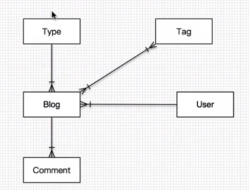
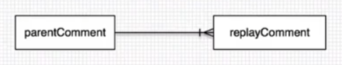
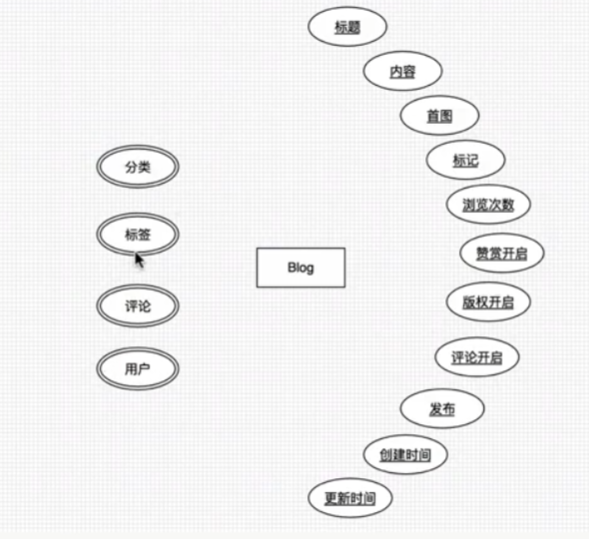
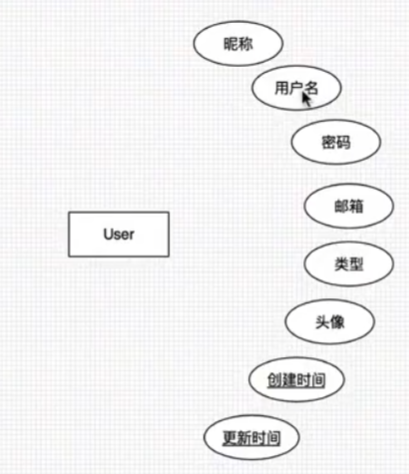

# Blog 

## Stake holder

### Normal user

- view all blog brief using paging 
  - brief include date, category, at least 3 tag, some text
- view the blog list in time, like, views order
- view all the category
- search the blog using category  
- search the blog using tag
- search the blog using keyword
- view the content individual blog
- comment on the blog
- like the blog

### Me Administrator 

- Manage blogs
  - Publish blog
  - categories the blog
  - tag the blog
  - edit the blog
  - delete the blog
  - search the blog in the admin page
- Manage categories
  - Add a new categories
  - edit a categories
  - delete a categories
  - search a categories
- Manage tags
  - add a new tag
  - edit a tag
  - delete a tag
  - search a tag

## Front end page
- Home page 
  - list blog brief 
  - display top tag
  - display top categories
  - recommend blog?
- Categories
  - Dispaly all/part categories
  - list blog brief when click a categories 
  - search a categories
- Tags
  - Dispaly all/part categories
  - list blog brief when click a categories 
  - search a tag
- Archive
  - List blog in order or year, view,, like

## Backend 

- Blog management
  - add
  - edit
  - delete
  - search
- Categories
  - add
  - edit
  - delete
  - search
- Tag
  - add
  - edit
  - delete
  - search
- logger
  - request url
  - request ip
  - args
  - return

## Database

Blog to categories : one to many
Blog to tag : many to many
Blog to user : many to one
Blog to comment : one to many

### Blog class

### Tag class

just name, and id

### Categories 

Just name and id

### Comments 
User and content and create time, reply

### User

